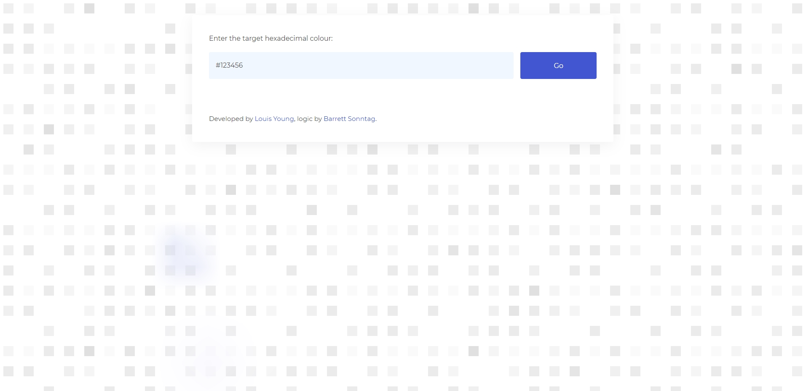

⚠️ Please note that this is an old project and does not reflect the quality of my current work.

# Recolour

A tool to generate the CSS filters to recolour an icon to a given colour.

## Description

A toolthat given a target hexadecimal colour value, calculates the corresponding CSS `filter` properties to achieve the target colour.

## Motivation

I built this application as I often found myself needing colour variations of icons. This is a quick and easy way to achieve different coloured icons whilst using only one source image.

## Technologies

- JavaScript.
- React.
- Sass (BEM).

---

This project was bootstrapped with [Create React App](https://github.com/facebook/create-react-app).

### Available Scripts

In the project directory, you can run:

#### `npm start`

Runs the app in the development mode.\
Open [http://localhost:3000](http://localhost:3000) to view it in the browser.

The page will reload if you make edits.\
You will also see any lint errors in the console.

#### `npm test`

Launches the test runner in the interactive watch mode.\
See the section about [running tests](https://facebook.github.io/create-react-app/docs/running-tests) for more information.

#### `npm run build`

Builds the app for production to the `build` folder.\
It correctly bundles React in production mode and optimizes the build for the best performance.

The build is minified and the filenames include the hashes.\
Your app is ready to be deployed!

See the section about [deployment](https://facebook.github.io/create-react-app/docs/deployment) for more information.
